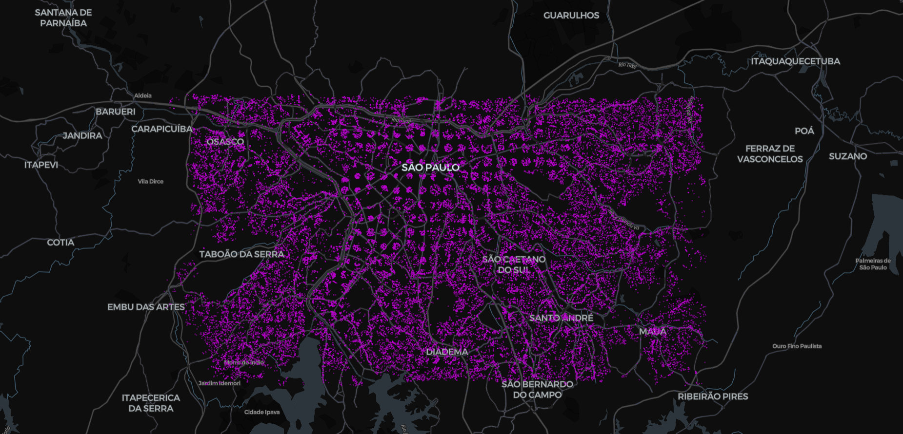

# nearby-restaurants-selector-api
Query nearby restaurants given a geolocation and distance.

<h2>To do list </h3>
<ol>
    <li>Geolocation API spike</li> 
    <li>Database design</li> 
    <li>Data pipeline</li>
    <li>Container design</li> 
    <li>Endpoint creation</li>
    <li>CRUD</li>
    <li>Request and response structure</li>
    <li>Auth token</li>
    <li>Exceptions handling</li>
    <li>Tests</li>
</ol>

<h2>Coverage area in São Paulo</h2>



<h2>Running locally</h2>

- Install Docker
```console
sudo apt-get install docker.io
sudo apt install docker-compose
```

needed this but dont know why
```console
 systemctl start docker
 systemctl enable docker
```


- Run the following command to create images and run the containers

```console
cd app
```
- Build SpringBoot application with gradle

```console
gradlew build
```

```console
cd ..
```


```console
sudo docker-compose up -d
```

- Check if MySQL is ready for connections

```console
docker logs CONTAINER_ID
```

- Check if MySQL table is available

```console
docker exec -it CONTAINER_ID mysql -p
```

```console
mysql> SELECT * FROM restaurants_geolocation_api.restaurants LIMIT 10;
```


